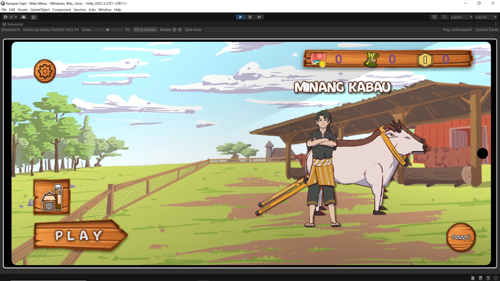
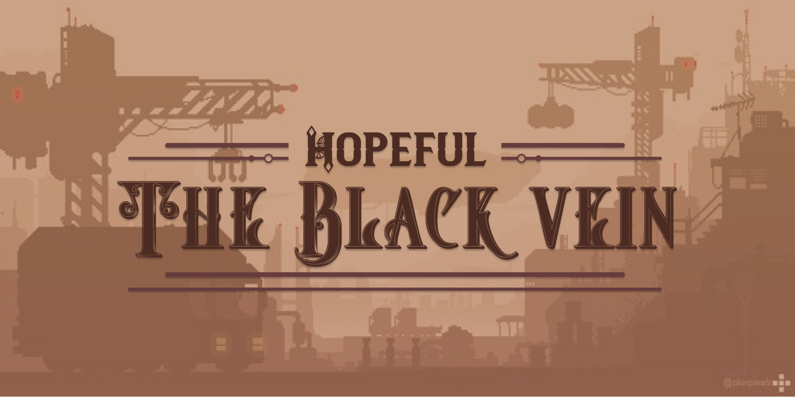
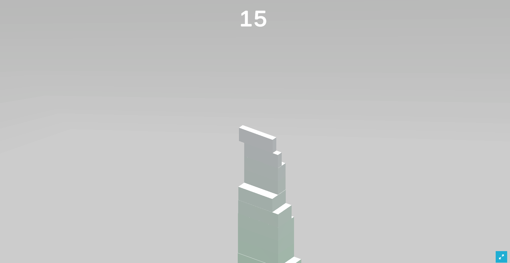
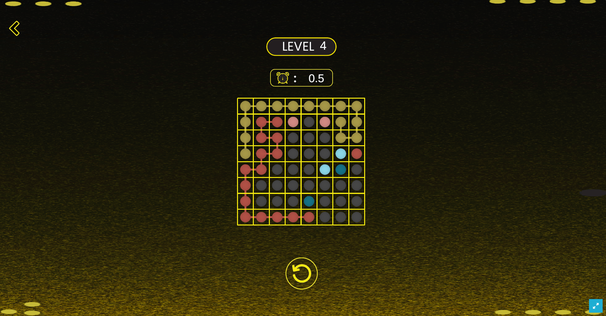
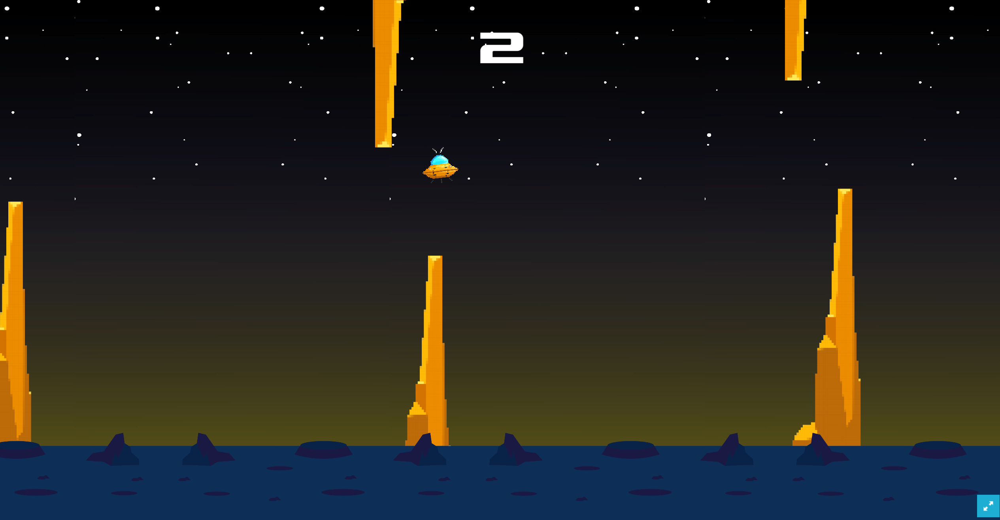
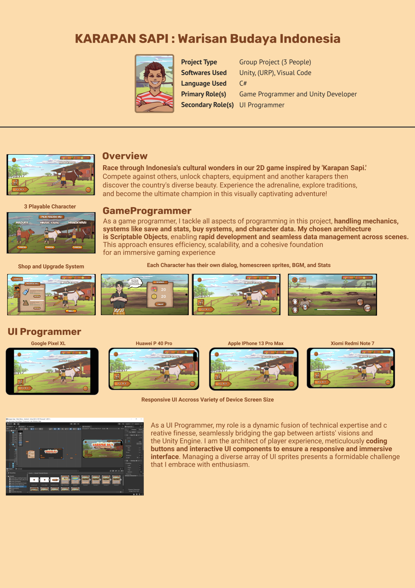

# Karapan Sapi, Warisan Budaya Indonesia

## About the Project

Welcome to **Karapan Sapi, Warisan Budaya Indonesia Game**, an exhilarating racing game inspired by the traditional Indonesian sport of buffalo racing, known locally as "Karapan Sapi". In this adrenaline-fueled adventure, players dive into the heart of rural Indonesia, where they take on the role of skilled jockeys competing in intense races atop mighty buffaloes.

### Technical Details:

- **Android Build**
- **Unity Version:** 2022.3
- **Development Tools:** Visual Studio 
- **Programming Language:** C#
- **Architecture:** Utilized Scriptable Objects for managing game data and inter-scene communication.
- **UI Approach:** Employed adaptive UI elements for seamless navigation and user interaction across different scenes.
- **Audio Management:** Implemented dynamic audio systems to enhance immersion and provide contextual audio cues.

## Video

## Team

### Tegar Cahya Bayu Siregar
- **Role**: Programmer & Unity Developer
- **Responsibilities**:
    - System architecture
    - Developing the game in Unity 
    - Ensuring responsive UI in diverse device
    - Programming, Developing, Optimizing and Deploying in Android

### Yopan
- **Role**: 2D Asset Creation and Animation
- **Responsibilities**:
    - Creating game sprites
    - Creating sprites animation
    - Creating environment sprites
    - Creating all gameplay sprites

### Muhammad Fadhil
- **Role**: Game Designer, Lead and Music
- **Responsibilities**:
    - Leader
    - Designing the game
    - Designing gameplay
    - Designing interface
    - Creating interface asset

## My Work

### Programming
My role in the development of the game, themed around traditional Indonesian buffalo racing ("Karapan Sapi"), involved comprehensive programming tasks, leveraging Unity's robust capabilities:

- **Game Mechanics**: Engineered the core racing mechanics, allowing for dynamic obstacle interactions and competitive AI-controlled opponents. Implemented features such as speed boosts, variable racer stamina, and collision effects tailored to mimic the intensity and strategy of buffalo racing.
- **Character and Item Systems**: Developed a system for managing characters and items using Unity's Scriptable Objects. This approach enabled efficient management of different character stats, upgrade paths, and item effects (both offensive and buffs), ensuring that game data remains flexible and easily configurable.
- **Economy System**: Programmed an in-game currency system, which players use to purchase new characters and items. The system is integrated with game progression, rewarding players with currency for race performance, unlocking new maps, and achieving specific milestones.

### Responsive UI Approach
I designed and implemented a UI that enhances player interaction and provides seamless navigation across various scenes including the main menu, settings, map selection, and gameplay:

- **Dynamic UI Elements**: Created adaptive UI elements that respond to game state changes and player interactions, such as updating character stats, item availability, and race results in real-time.
- **Scene Management**: Utilized Unity's scene management to ensure smooth transitions between different game scenes while maintaining state consistency across the UI, including options and player settings.

### Game Architecture
Focused on creating a scalable and maintainable architecture, my contributions ensured that game features could be updated and expanded efficiently:

- **Scriptable Object Utilization**: Leveraged Scriptable Objects for managing not only character and item data but also inter-scene communication. This method proved essential for maintaining a clean and modular codebase, facilitating easier updates and scalability.
- **Audio Management**: Implemented a dynamic audio management system where each character could have unique background music that enhances their individuality and the overall game atmosphere. This system integrates seamlessly with the game's state management to provide contextual audio cues.
- **Data Persistence**: Designed a robust data persistence system to save player progress, including unlocked characters, items, and maps. This system uses serialization to store data locally, ensuring players can resume their progress seamlessly.

## Others Published Game Developed By Me and Team

Below is a list of other notable games I have developed, each showcasing a range of skills and innovative game mechanics. Click on the titles to learn more about each project.

### 1. [RPS DUEL -> Sick Cycles Studio](https://reds8991.itch.io/rps-duel)
**Platform:** Windows  
**Description:** 
- RPS: DUEL is a turn-based 1v1 fighting game that aim to recreate the concept of fighting game in mobile platform

- **Mechanics** in this game include turn based combat system, animation based damage and vfx triggering, sound system, highly complicated animation system, combo based system.

- **My role** in this project is all about developing the game as i'm the only game developer in this project

### 2. [Hopeful : The Black Vein -> Silent Game Production](https://silent-games-production.itch.io/hopeful-the-black-vein)
**Platform:** Windows  
**Description:**
- This game is a 2D Platformer Puzzle game which take set in the steampunk era. Players have to take medicine, stored in secret labs in order to cure the his poor little sister. Player have to breach the facility, overcome various obstacle, and uncover the secret.

- **Mechanics** including in this game is 2D movement system, obstacle system, scene management system and save system through scriptable object

- There are 2 progammer in this project and my part was **UI and Sound Progammer**. 

### 3. [Stacks -> UlinPoint](https://ulinpoint.id/stacks)
**Platform:** Web  
**Description:**
- This game is a viral stacking block game that challange player to stacking as many as possible block to get higher score. precision is a must in this game

- **Mechanics** include detecting bounding box of the block in order to cut the block if player is not percisly align the block

- My role is Unity Developer and i'm the only programmer in this project **UI and Sound Progammer**. 

### 4. [Line Connect -> UlinPoint](https://ulinpoint.id/lineconnect)
**Platform:** Web  
**Description:**
- this is a game to challange player to solve as many puzzle as possible to get higher score.

- **Mechanics** include connecting any non crossed colored node in the graph to win each level. more level passed, more harder it is. 
- My role is Unity Developer and i'm the only programmer in this project. 

### 4. [Ufo Swings -> UlinPoint](https://ulinpoint.id/ufoswing)
**Platform:** Web  
**Description:**
- This game is inspired by flappy bird but in space using an alien vehivle (UFO)
- **Mechanics** UFO is attracted by gravitational of planet and player need to click for keeping UFO off the ground. Furthermore, randomly generated obstacles heading towards the UFO
- My role is Unity Developer and i'm the only programmer in this project. 

## Project Portofolio Image
